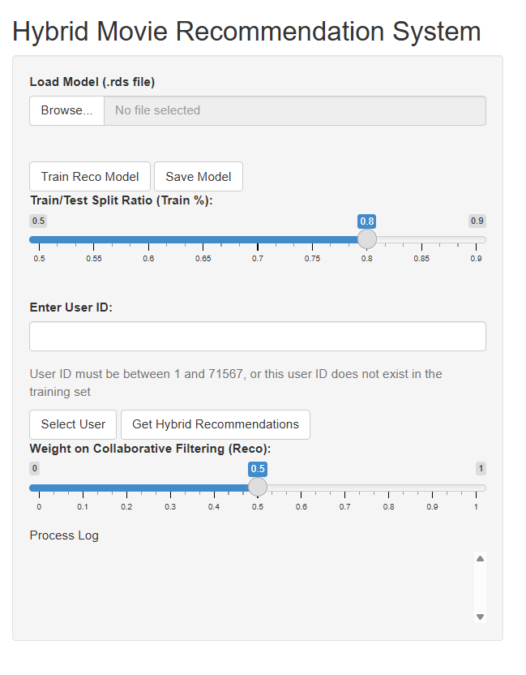
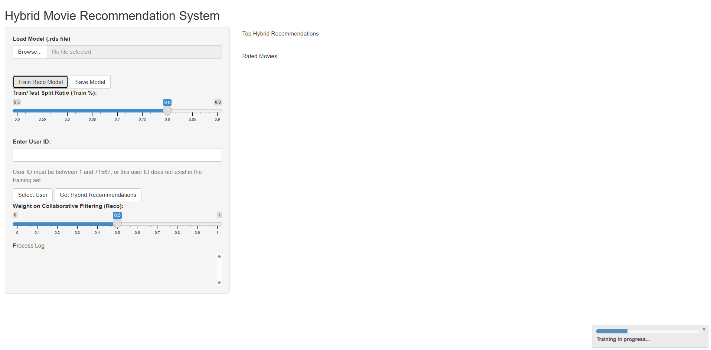
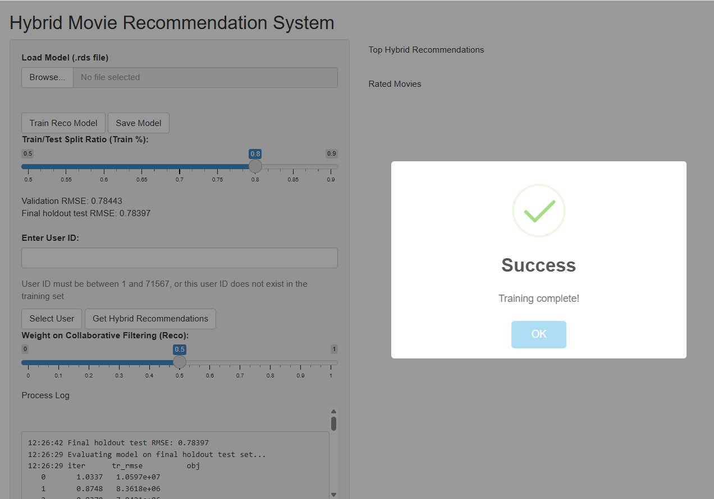
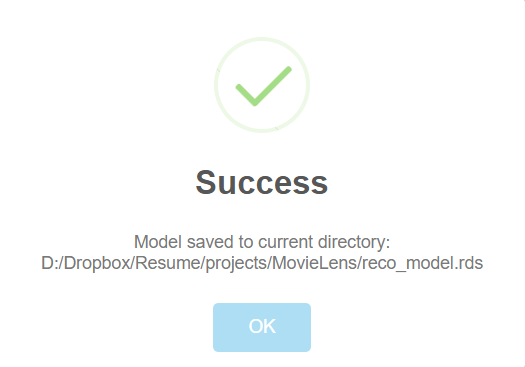
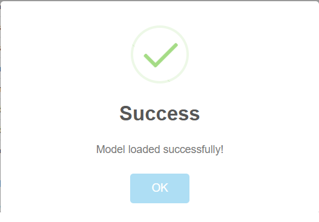
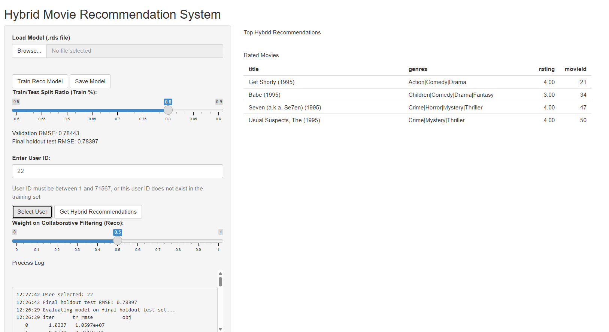
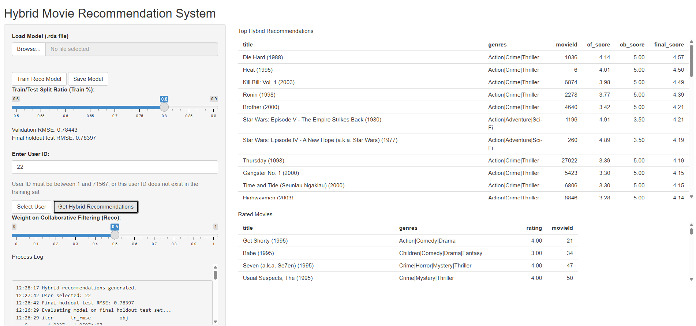
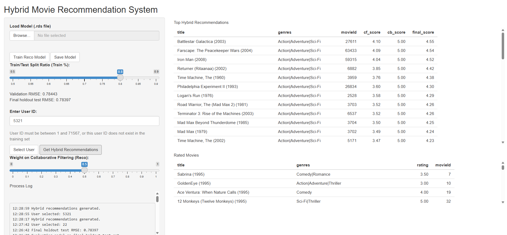

# Hybrid Movie Recommendation System

An interactive **R Shiny** application that recommends movies using a hybrid recommendation approach that combines collaborative filtering and TF-IDF-based content similarity.

## Overview

This project builds a movie recommendation system on top of the MovieLens 10M dataset.  
It trains a matrix factorization model with `recosystem` for collaborative filtering and uses TF-IDF over movie genres for content-based similarity.

The app lets users:

- Train a recommendation model.
- Load and save trained models.
- Evaluate validation and holdout RMSE.
- Enter a user ID and get personalized movie recommendations.
- Tune the balance between collaborative filtering and content-based scoring.

## Features

- Hybrid recommendation engine.
- Collaborative filtering with matrix factorization.
- Content-based filtering using TF-IDF cosine similarity.
- Interactive Shiny UI.
- Model training and validation.
- Final holdout evaluation.
- Save and load model support.
- User-specific rated movies display.
- Recommendation scoring with adjustable hybrid weight.

## Project Structure

- `app.R` — Main Shiny application.
- `edx.rds` — Training dataset saved locally after first run.
- `final_holdout_test.rds` — Final holdout dataset saved locally after first run.
- `reco_model.rds` — Saved trained model file.

## Requirements

### R packages

The app uses the following packages:

- `shiny`
- `dplyr`
- `recosystem`
- `tm`
- `proxy`
- `caret`
- `rstudioapi`
- `shinyalert`
- `tidyverse`

### Software

- R 4.5.0 or later.
- RStudio recommended.
- Internet access for the first run to download the MovieLens dataset.

## Installation

1. Clone the repository:

```bash
git clone https://github.com/your-username/hybrid-movie-recommender.git
cd hybrid-movie-recommender
```

2. Open the project in RStudio.
3. Install the required packages if prompted.
4. Run the app:
```r
shiny::runApp()
```


## Usage

1. Launch the app.
2. Click **Train Reco Model** to train the collaborative filtering model.
3. Optionally save the trained model with **Save Model**.
4. Enter a valid **User ID** and click **Select User**.
5. Adjust the **Weight on Collaborative Filtering** slider if desired.
6. Click **Get Hybrid Recommendations** to generate recommendations.

## Data Workflow

On the first run, the app:

- Downloads the MovieLens 10M dataset.
- Creates `edx` and `final_holdout_test` splits.
- Saves both datasets as `.rds` files in the working directory.

On later runs, the app loads the saved `.rds` files to reduce startup time.

## Recommendation Method

The system combines two scoring methods:

- **Collaborative filtering**: predicts ratings using matrix factorization.
- **Content-based filtering**: computes movie similarity from genre TF-IDF vectors.

The final recommendation score is a weighted blend of both methods, controlled by the hybrid weight slider.

## Notes

- The first training run may take a few minutes.
- The app uses the active script directory as the working directory.
- `reco_model.rds`, `edx.rds`, and `final_holdout_test.rds` are generated locally and can be reused later.
- Make sure the selected user ID exists in the training set.


## License

Add your preferred license here, such as MIT or Apache-2.0.

## Acknowledgements

- MovieLens dataset from GroupLens.
- `recosystem` for matrix factorization.
- `shiny` for the interactive web app.

### Demo


### Main Screen



### Training Process



### Training Complete



### Model Saved



### Model Loaded



### User Selected



### Get Recommendations 1



### Get Recommendations 2




## Author

**Sergii Iuriev**

Computational Research Scientist | Data Scientist |  AI/ML Engineer
